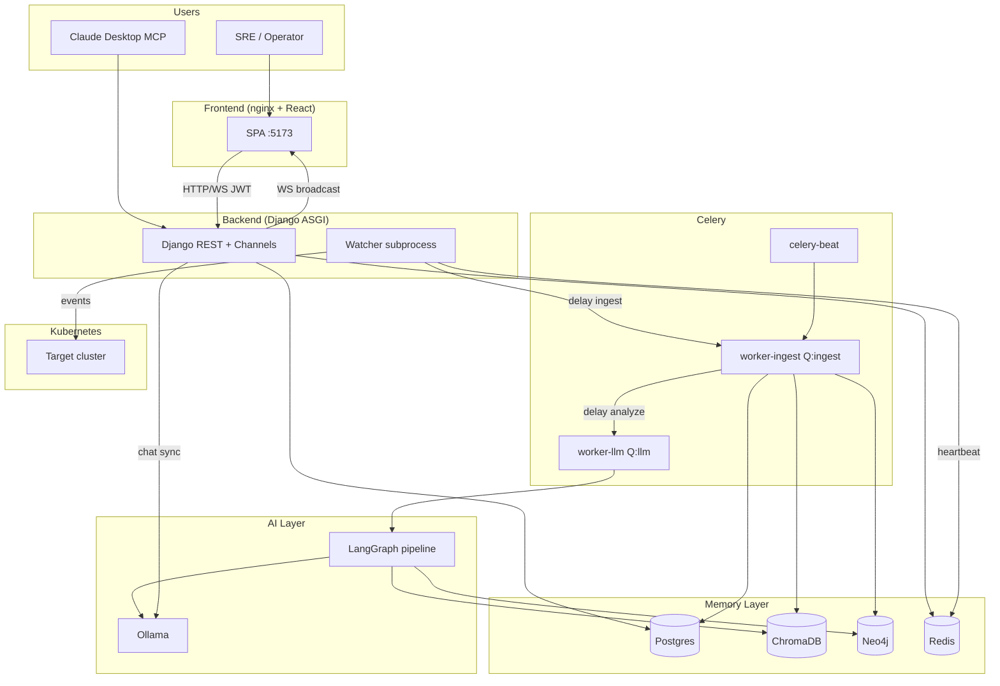
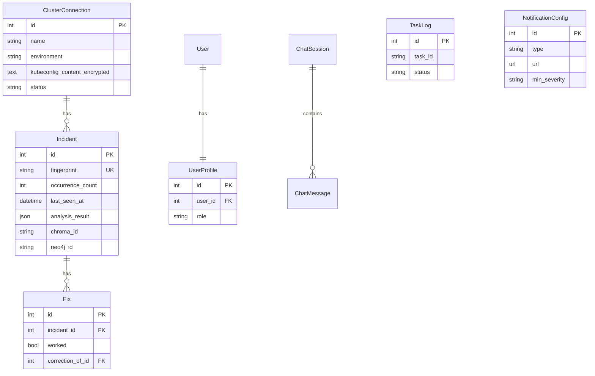
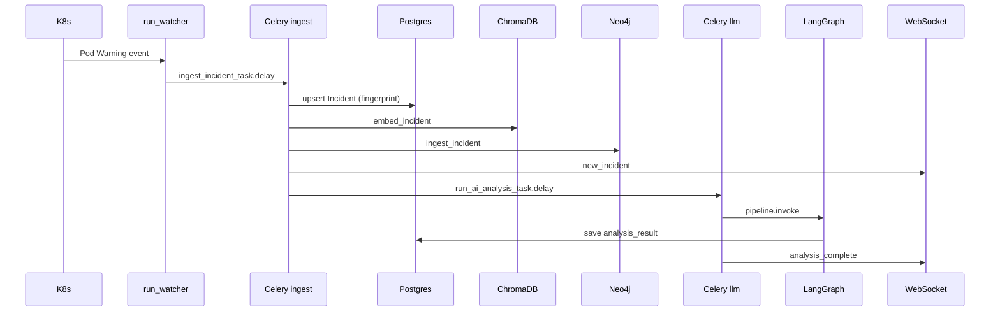

# KubeMemory — Technical Overview, System Design & Implementation Status

> Last updated: 2026-05-28  
> Audience: engineers, architects, and auditors onboarding to KubeMemory  
> Scope: system design (FR/NFR, HLD, LLD) + Phases A–E completion matrix + platform inventory

**Table of contents**

1. [Executive summary](#1-executive-summary)  
2. [System design](#2-system-design)  
   - [Functional requirements](#21-functional-requirements-fr)  
   - [Non-functional requirements](#22-non-functional-requirements-nfr)  
   - [High-level design (HLD)](#23-high-level-design-hld)  
   - [Low-level design (LLD)](#24-low-level-design-lld)  
3. [Task-list completion matrix (Phases A–E)](#3-task-list-completion-matrix-phases-ae)  
4. [Platform features](#4-platform-features-pre-existing--phase-6)  
5. [API surface](#5-api-surface-complete)  
6. [Data models](#6-data-models-key-fields)  
7. [Known gaps & technical debt](#7-known-gaps--technical-debt)  
8. [Verification checklist](#8-verification-checklist)  
9. [File map](#9-file-map-new--changed-in-ae-pass)  
10. [Recommended next steps](#10-recommended-next-steps)  
11. [Architecture diagram (compact)](#11-architecture-diagram-compact)

---

## 1. Executive summary

**KubeMemory** is a local-first, persistent AI brain for Kubernetes clusters. It watches K8s events, stores incidents in Postgres + ChromaDB (vectors) + Neo4j (graph), runs a LangGraph multi-agent pipeline via Ollama, and exposes a React dashboard, WebSockets, MCP (Claude Desktop), and an in-app chat assistant.

| Dimension | Status |
|-----------|--------|
| **Core platform (Phases 1–6)** | Implemented in codebase; predates security/observability hardening |
| **Security hardening (Phase A)** | Implemented in working tree; **not committed** to `main` yet |
| **Observability (Phase B)** | Implemented in working tree |
| **AI quality (Phase C)** | Implemented in working tree |
| **Prod hardening (Phase D)** | Mostly implemented; some gaps (see §6) |
| **Usability (Phase E)** | Implemented in working tree |
| **Runtime verification** | Not fully run in CI/local during last dev session (Docker Compose unavailable in agent env) |

**Git state:** `main` is at commit `039afb7`. All Phase A–E work exists as **uncommitted local changes** (~40 modified files + new apps/monitoring, accounts, tests, CI).

---

## 2. System design

### 2.0 Context & problem statement

Every conventional K8s observability tool treats each incident as a one-off event. KubeMemory **persists** incident history across three complementary stores (relational, vector, graph), runs **multi-agent GraphRAG** over that history, and surfaces results through a **real-time dashboard**, **chat assistant**, and **MCP** integration — all on **local infrastructure** (Ollama, no cloud LLM).

**Primary actors**

| Actor | Interaction |
|-------|-------------|
| SRE / on-call engineer | Dashboard, incident detail, fixes, risk-check, chat |
| Platform operator | Cluster connect, watcher start/stop, settings, notifications |
| Admin | User roles, Django admin, secrets via `.env` |
| Claude Desktop (MCP client) | Stdio MCP tools over cluster memory |
| Kubernetes API | Read-only events/pods/logs via watcher |
| Celery beat | Scheduled health, prune, backup tasks |

**System boundary**

```
┌─────────────────────────────────────────────────────────────────┐
│                     KubeMemory (Docker Compose)                  │
│  React UI │ Django API │ Celery │ Ollama │ Chroma │ Neo4j │ PG  │
└───────────────────────────────┬─────────────────────────────────┘
                                │ read-only K8s API
                                ▼
                        ┌───────────────┐
                        │  User cluster │
                        │ (Kind/EKS/…)  │
                        └───────────────┘
```

External (out of scope for v1): cloud LLM APIs, PagerDuty/Slack SaaS beyond webhook POST, multi-tenant SaaS hosting.

---

### 2.1 Functional requirements (FR)

Requirements are grouped by domain. **Status** reflects the current working tree.

#### FR-1 — Cluster ingestion

| ID | Requirement | Priority | Status |
|----|-------------|----------|--------|
| FR-1.1 | Connect cluster via paste kubeconfig, file path, context, or in-cluster | Must | ✅ |
| FR-1.2 | Test connectivity and list namespaces before watching | Must | ✅ |
| FR-1.3 | Watch K8s Events (Warning/Failed) for Pods in selected namespaces | Must | ✅ |
| FR-1.4 | Map event reasons to incident types (CrashLoop, OOM, ImagePull, etc.) | Must | ✅ |
| FR-1.5 | Fetch pod logs excerpt on incident detection | Should | ✅ |
| FR-1.6 | Support multiple clusters with environment tag (dev/staging/prod) | Should | ✅ |
| FR-1.7 | Encrypt pasted kubeconfig at rest (Fernet) | Must | ✅ |
| FR-1.8 | Watcher heartbeat with automatic WatcherDown incident if stale | Should | ✅ |

#### FR-2 — Incident lifecycle

| ID | Requirement | Priority | Status |
|----|-------------|----------|--------|
| FR-2.1 | Create incident record on first occurrence | Must | ✅ |
| FR-2.2 | Deduplicate same pod/type within 5-minute window (fingerprint) | Must | ✅ |
| FR-2.3 | Track `occurrence_count`, `first_seen`, `last_seen` | Must | ✅ |
| FR-2.4 | CRUD incidents; update status (open/investigating/resolved) | Must | ✅ |
| FR-2.5 | Submit fixes; corrective RAG when engineer overrides AI | Must | ✅ |
| FR-2.6 | Estimate cost waste (`estimated_waste_usd`) | Could | ✅ |
| FR-2.7 | Push real-time updates via WebSocket (`new_incident`, `incident_updated`, `analysis_complete`) | Must | ✅ |

#### FR-3 — Memory & search (GraphRAG)

| ID | Requirement | Priority | Status |
|----|-------------|----------|--------|
| FR-3.1 | Embed incidents in ChromaDB (Ollama embeddings) | Must | ✅ |
| FR-3.2 | Ingest incidents into Neo4j causal graph (pods, incidents, fixes) | Must | ✅ |
| FR-3.3 | Semantic search over incident history | Must | ✅ |
| FR-3.4 | Blast-radius and deploy-crash pattern queries | Must | ✅ |
| FR-3.5 | Prune vectors/graph older than retention window | Should | ✅ |
| FR-3.6 | Re-embed all incidents when embedding model changes | Should | ✅ |

#### FR-4 — AI analysis

| ID | Requirement | Priority | Status |
|----|-------------|----------|--------|
| FR-4.1 | LangGraph pipeline: Retriever → Correlator → Recommender | Must | ✅ |
| FR-4.2 | Structured analysis output (`AnalysisResult` JSON) | Must | ✅ |
| FR-4.3 | Route fast model (chat/suggestions) vs reasoning model (analysis/runbook) | Should | ✅ |
| FR-4.4 | Trigger analysis on ingest (async Celery) or on-demand (sync API) | Must | ✅ |
| FR-4.5 | Generate runbook markdown from cluster history | Should | ✅ |
| FR-4.6 | Pre-deploy risk check for a service/namespace | Should | ✅ |
| FR-4.7 | Chat assistant with tool use over cluster memory | Must | ✅ |
| FR-4.8 | MCP server exposing same tools to Claude Desktop | Should | ✅ |

#### FR-5 — User interface

| ID | Requirement | Priority | Status |
|----|-------------|----------|--------|
| FR-5.1 | Dashboard: open incidents, health, live feed, patterns, 7-day chart | Must | ✅ |
| FR-5.2 | Incident list and detail with AI analysis and fix form | Must | ✅ |
| FR-5.3 | Graph explorer (force-directed causal graph) | Should | ✅ |
| FR-5.4 | Patterns page (recurring failure aggregates) | Should | ✅ |
| FR-5.5 | Cluster connect wizard | Must | ✅ |
| FR-5.6 | Status page: Ollama, watcher heartbeat, failed Celery tasks | Should | ✅ |
| FR-5.7 | Settings: notifications (Slack/webhook), preferences | Should | ✅ |
| FR-5.8 | Responsive layout for mobile/tablet | Could | ✅ |
| FR-5.9 | JWT login; protect all routes except `/login` and public API | Must | ✅ |

#### FR-6 — Security & access control

| ID | Requirement | Priority | Status |
|----|-------------|----------|--------|
| FR-6.1 | JWT authentication on REST API | Must | ✅ |
| FR-6.2 | Roles: viewer, operator, admin | Must | ✅ |
| FR-6.3 | Operators required for watcher connect/start/stop | Must | ✅ |
| FR-6.4 | Viewers blocked from mutating prod cluster resources | Must | ✅ |
| FR-6.5 | K8s watcher uses least-privilege RBAC (read-only) | Must | ✅ |
| FR-6.6 | No secrets in source code; all via `.env` | Must | ✅ |

#### FR-7 — Operations

| ID | Requirement | Priority | Status |
|----|-------------|----------|--------|
| FR-7.1 | Health endpoint for load balancers / CI | Must | ✅ |
| FR-7.2 | Aggregated `/api/status/` for subsystem readiness | Should | ✅ |
| FR-7.3 | Celery task failure audit log | Should | ✅ |
| FR-7.4 | Notification on ingest (severity threshold) | Should | ✅ |
| FR-7.5 | Scheduled DB/vector backups | Should | ⚠️ partial |
| FR-7.6 | CI: lint, django-check, build, smoke test | Should | ✅ |

---

### 2.2 Non-functional requirements (NFR)

#### NFR-1 — Performance

| ID | Requirement | Target | Status |
|----|-------------|--------|--------|
| NFR-1.1 | Incident ingest latency (event → Postgres row) | < 5 s p95 (excl. AI) | 🔲 not benchmarked |
| NFR-1.2 | AI analysis (full LangGraph) | < 120 s (local Mistral 7B) | 🔲 model-dependent |
| NFR-1.3 | Semantic search | < 2 s for top-5 results | 🔲 not benchmarked |
| NFR-1.4 | Dashboard initial load | < 3 s on localhost | 🔲 not benchmarked |
| NFR-1.5 | WebSocket incident push | < 1 s after Celery completes | 🔲 not benchmarked |
| NFR-1.6 | Celery ingest queue concurrency | 4 workers (`ingest` queue) | ✅ |
| NFR-1.7 | LLM queue concurrency | 1 worker (avoid Ollama overload) | ✅ |

#### NFR-2 — Scalability & capacity

| ID | Requirement | Target | Notes |
|----|-------------|--------|-------|
| NFR-2.1 | Deployment model | Single-node Docker Compose (dev) | Kind + Compose default |
| NFR-2.2 | Incident volume | 10k incidents / 90-day retention | Chroma + Neo4j on disk |
| NFR-2.3 | Concurrent UI users | 1–10 (local team) | No horizontal API scaling yet |
| NFR-2.4 | Multi-cluster | N clusters, 1 active watcher process | PID file per cluster |
| NFR-2.5 | Horizontal scaling path | Future: split workers, external Chroma/Neo4j | Not implemented |

#### NFR-3 — Availability & reliability

| ID | Requirement | Target | Status |
|----|-------------|--------|--------|
| NFR-3.1 | Service restart policy | `unless-stopped` on all Compose services | ✅ |
| NFR-3.2 | Health checks on every Compose service | Defined in `docker-compose.yml` | ✅ |
| NFR-3.3 | Celery task retries | `max_retries=2–3` with backoff | ✅ |
| NFR-3.4 | Watcher auto-restart on API errors | Exponential backoff in watch loop | ✅ |
| NFR-3.5 | Watcher liveness detection | Heartbeat + beat task → WatcherDown incident | ✅ |
| NFR-3.6 | Target uptime (local dev) | Best-effort; no SLA | N/A |

#### NFR-4 — Security

| ID | Requirement | Target | Status |
|----|-------------|--------|--------|
| NFR-4.1 | Authentication | JWT Bearer on all protected REST routes | ✅ |
| NFR-4.2 | Authorization | RBAC roles on cluster mutations | ✅ |
| NFR-4.3 | Secrets management | `.env` only; `.gitignore` enforced | ✅ |
| NFR-4.4 | Kubeconfig storage | Fernet encryption in Postgres | ✅ |
| NFR-4.5 | Container user | Non-root `appuser` in backend image | ✅ |
| NFR-4.6 | K8s access | Read-only SA; no secret/configmap access | ✅ |
| NFR-4.7 | TLS to cluster | `insecure-skip-tls-verify` for local Kind only | ✅ (dev) |
| NFR-4.8 | WebSocket auth | JWT on WS connect | ❌ gap |
| NFR-4.9 | JWT storage (frontend) | Memory only; not localStorage | ✅ |

#### NFR-5 — Maintainability & operability

| ID | Requirement | Target | Status |
|----|-------------|--------|--------|
| NFR-5.1 | Modular Django apps under `backend/apps/` | One domain per app | ✅ |
| NFR-5.2 | Type hints + module docstrings (Python) | Per `.cursorrules` | ✅ mostly |
| NFR-5.3 | Structured logging | stdlib logging to stdout | ✅ |
| NFR-5.4 | Makefile shortcuts | `make dev`, `seed`, `test-pipeline`, etc. | ✅ |
| NFR-5.5 | Migrations for all model changes | Django migrations | ✅ |
| NFR-5.6 | CI pipeline | GitHub Actions 4 jobs | ✅ (unverified on push) |
| NFR-5.7 | Developer docs | README, QUICK_REFERENCE, CLUSTER_CONNECT, TECH.md | ✅ |

#### NFR-6 — Cost & deployment constraints

| ID | Requirement | Target | Status |
|----|-------------|--------|--------|
| NFR-6.1 | Zero cloud LLM cost | Ollama local only | ✅ |
| NFR-6.2 | RAM budget | ~8 GB minimum (4 GB for Ollama models) | Documented in README |
| NFR-6.3 | Pinned Docker images | No `:latest` in compose | ✅ |
| NFR-6.4 | Multi-stage Docker builds | Backend 3-stage, frontend 2-stage | ✅ |

#### NFR-7 — Data retention & compliance

| ID | Requirement | Target | Status |
|----|-------------|--------|--------|
| NFR-7.1 | Vector retention | `CHROMA_RETENTION_DAYS` default 90 | ✅ |
| NFR-7.2 | Backup retention | `BACKUP_RETENTION_DAYS` default 7 | ✅ |
| NFR-7.3 | Right to erase | `clear_all` incidents API + disconnect cluster | ✅ |
| NFR-7.4 | PII in incidents | Pod names, logs only; no user PII by design | ✅ |

---

### 2.3 High-level design (HLD)

#### 2.3.1 Logical architecture (C4 — Container level)



#### 2.3.2 Major subsystems

| Subsystem | Responsibility | Technology |
|-----------|----------------|------------|
| **Ingestion** | Watch K8s, normalize events, dedupe, persist, notify | `run_watcher`, Celery `ingest` |
| **Memory** | Vector + graph storage and query | ChromaDB, Neo4j, `memory` app |
| **Intelligence** | RAG retrieval, correlation, recommendation | LangGraph, Ollama |
| **Presentation** | Dashboard, chat, connect wizard | React, React Query, Zustand |
| **Integration** | MCP tools, webhooks, Slack | `mcp_server`, `monitoring` |
| **Security** | AuthN/Z, encrypted credentials | JWT, UserProfile, Fernet |
| **Observability** | Heartbeats, task logs, status API | Redis keys, `monitoring` app |

#### 2.3.3 Primary data flows

**Flow A — Incident detection (happy path)**

```
K8s Event → run_watcher → ingest_incident_task (ingest queue)
  → fingerprint dedup?
     yes → update occurrence_count → WS incident_updated
     no  → Postgres Incident
         → Chroma embed
         → Neo4j ingest
         → WS new_incident
         → send_notification (if severity ≥ threshold)
         → run_ai_analysis_task (llm queue)
              → LangGraph pipeline
              → save analysis_result
              → WS analysis_complete
```

**Flow B — Engineer submits fix (corrective RAG)**

```
UI POST /api/incidents/{id}/fixes/
  → Postgres Fix
  → update_corrective_rag_task (ingest queue)
       → Chroma correction doc (if correction_of set)
       → Neo4j resolve (if worked)
```

**Flow C — Chat question**

```
UI POST /api/chat/sessions/{id}/message/
  → ChatEngine (sync, fast Ollama model)
  → tool calls → memory/agents tools
  → stream response via HTTP or WS
  → persist ChatMessage rows
```

**Flow D — Cluster connect**

```
UI POST /api/clusters/ (operator JWT)
  → encrypt kubeconfig_content → Postgres
  → write kubeconfig file to disk
  → POST connect / start-watcher
  → watcher_manager spawns run_watcher subprocess
  → heartbeat thread → Redis
```

#### 2.3.4 Deployment architecture (physical)

```
Host machine (dev)
├── docker network: kubememory-net
│   ├── postgres:5432
│   ├── redis:6379
│   ├── neo4j:7474/7687
│   ├── ollama:11434
│   ├── django-api:8000  (Daphne ASGI)
│   ├── celery-worker-ingest
│   ├── celery-worker-llm
│   ├── celery-beat
│   └── frontend:5173→80 (nginx proxies /api, /ws)
├── kind cluster (optional, host network or kind network)
└── volumes: postgres_data, neo4j_data, ollama_data, chroma_data, backup_data
```

Production overlay: `docker-compose.prod.yml` — prod Django settings, frontend on `:80`, no exposed API port.

#### 2.3.5 Integration points

| Integration | Protocol | Direction | Auth |
|-------------|----------|-----------|------|
| React ↔ Django | HTTP REST | Bidirectional | JWT Bearer |
| React ↔ Django | WebSocket | Server push | None (gap) |
| Watcher ↔ K8s API | HTTPS | Read-only pull | kubeconfig / in-cluster SA |
| Django ↔ Ollama | HTTP `/api/chat`, `/api/embeddings` | Request/response | None (internal network) |
| Django ↔ Chroma | Embedded library | In-process | N/A |
| Django ↔ Neo4j | Bolt | Cypher queries | `NEO4J_USER/PASSWORD` |
| MCP ↔ Django | Stdio JSON-RPC | Tool calls | Local process |
| Notifications ↔ Slack/webhook | HTTPS POST | Outbound | URL in DB config |

---

### 2.4 Low-level design (LLD)

#### 2.4.1 Module decomposition (backend)

```
backend/
├── config/
│   ├── settings/base|dev|prod.py   # env-driven config
│   ├── urls.py                     # route mounting
│   ├── permissions.py              # JWT public paths + RBAC helpers
│   ├── status_views.py             # aggregated health
│   ├── celery.py                   # app + autodiscover
│   └── asgi.py                     # HTTP + WebSocket router
├── apps/incidents/
│   ├── models.py                   # Incident, Fix, ClusterPattern
│   ├── tasks.py                    # ingest, analyze, corrective RAG
│   ├── fingerprint.py              # SHA256 dedup key
│   ├── views.py                    # DRF ViewSets
│   └── serializers.py
├── apps/memory/
│   ├── vector_store.py             # IncidentVectorStore (Chroma + Ollama embed)
│   └── graph_builder.py            # KubeGraphBuilder (Neo4j Cypher)
├── apps/agents/
│   ├── state.py                    # AgentState TypedDict
│   ├── agents.py                   # retriever, correlator, recommender, runbook
│   ├── pipeline.py                 # LangGraph compile + analyze_incident
│   ├── schemas.py                  # AnalysisResult (Pydantic)
│   ├── llm_config.py               # fast vs reasoning model resolution
│   └── ollama_health.py            # model readiness probe
├── apps/watcher/
│   ├── management/commands/run_watcher.py
│   └── heartbeat.py                # Redis TTL heartbeat
├── apps/clusters/
│   ├── models.py                   # ClusterConnection + EncryptedTextField
│   ├── watcher_manager.py          # subprocess lifecycle, kubeconfig files
│   └── views.py                    # CRUD + connect + RBAC permissions
├── apps/chat/
│   ├── engine.py                   # ChatEngine (Ollama tools loop)
│   ├── models.py                   # ChatSession, ChatMessage
│   └── consumers.py                # WS chat stream
├── apps/monitoring/
│   ├── models.py                   # TaskLog, NotificationConfig
│   ├── signals.py                  # Celery failure hooks
│   └── tasks.py                    # health, prune, backup, notify
└── apps/accounts/
    ├── models.py                   # UserProfile
    └── signals.py                  # auto-create profile on User save
```

#### 2.4.2 LangGraph pipeline (LLD)

**State machine**

```
ENTRY → retrieve → correlate → recommend → END
```

| Node | Input (from state) | Output (to state) | External I/O |
|------|-------------------|-------------------|--------------|
| `retriever_agent` | pod, namespace, description | `similar_incidents`, `past_fixes`, `corrections` | ChromaDB query |
| `correlator_agent` | pod, namespace | `causal_patterns`, `blast_radius`, `deploy_correlation` | Neo4j Cypher |
| `recommender_agent` | full state | `analysis_result`, `recommendation`, `root_cause`, `confidence` | Ollama (reasoning model) |

**Error handling:** each node catches exceptions, appends to `state["errors"]`, returns partial state (never raises).

**AnalysisResult schema**

```python
class AnalysisResult(BaseModel):
    confidence_score: float          # 0.0–1.0
    severity: Literal["low","medium","high","critical"]
    root_cause_hypothesis: str
    affected_services: list[str]
    recommended_actions: list[str]
    runbook_steps: list[str]
```

#### 2.4.3 Incident deduplication (LLD)

```python
fingerprint = SHA256(
    f"{namespace}|{pod_name}|{incident_type}|{timestamp // 300}|{cluster_id?}"
)
```

| Event | DB action | WebSocket |
|-------|-----------|-----------|
| New fingerprint | INSERT Incident, embed, graph | `new_incident` |
| Existing fingerprint | `occurrence_count += 1`, update `last_seen_at` | `incident_updated` |

Unique constraint on `Incident.fingerprint` prevents duplicate rows under concurrency (second insert would fail — retry path should update; current code checks before insert).

#### 2.4.4 Celery task routing (LLD)

| Task | Queue | Worker | Trigger |
|------|-------|--------|---------|
| `ingest_incident_task` | `ingest` | worker-ingest ×4 | Watcher event |
| `update_corrective_rag_task` | `ingest` | worker-ingest | Fix POST |
| `run_ai_analysis_task` | `llm` | worker-llm ×1 | After ingest |
| `check_watcher_health` | `ingest` | beat → ingest | Every 60s |
| `prune_old_vectors` | `ingest` | beat | Every 24h |
| `backup_databases` | `ingest` | beat | Every 24h |
| `send_notification` | `ingest` | worker-ingest | After new ingest |

#### 2.4.5 Redis keys

| Key pattern | TTL | Writer | Reader |
|-------------|-----|--------|--------|
| `watcher:heartbeat:{cluster_id}` | 45s | Watcher thread | `check_watcher_health`, `/api/status/` |
| `ollama:ready` | 300s | `verify_ollama_models` | `/api/status/` |

Channel layer groups: `incidents` (WebSocket fan-out).

#### 2.4.6 Authentication & authorization (LLD)

```
HTTP Request
  → DRF JWTAuthentication (Authorization: Bearer)
  → IsAuthenticatedOrPublicPath
       if path in {/api/token/, /api/token/refresh/, /api/health/} → allow
       else require authenticated user
  → View-level permissions (clusters):
       IsClusterOperator + CanMutateClusterEnvironment
       operator/admin: mutate OK
       viewer: object-level block on environment=prod
```

Frontend: `uiStore.accessToken` in memory; axios interceptor attaches Bearer; 401 → redirect `/login`.

#### 2.4.7 Database schema (core ER)



Neo4j and ChromaDB are **not** relational — linked by `chroma_id` / `neo4j_id` on Incident.

#### 2.4.8 Frontend component architecture (LLD)

```
main.jsx
  └── App.jsx
        ├── /login → Login.jsx
        └── RequireAuth → AppShell.jsx
              ├── TopBar, nav (React Router)
              └── Outlet (pages)
                    ├── Dashboard.jsx      → useIncidents, useWebSocket, incidentStore
                    ├── IncidentsList.jsx    → useIncidents
                    ├── IncidentDetail.jsx   → useAnalysis, fixes API
                    ├── GraphExplorer.jsx    → useGraphData, react-force-graph-2d
                    ├── Chat.jsx             → useChat, useChatWebSocket
                    ├── ClusterConnect.jsx   → clusters API
                    ├── Status.jsx           → useSystemStatus, useWatcherStatus
                    └── Settings.jsx         → uiStore, notifications API

src/api/client.js   ← axios + JWT interceptor (single HTTP client)
src/store/
  ├── uiStore.js    ← JWT (memory), UI prefs (localStorage via partialize)
  └── incidentStore.js ← WebSocket live buffer (Zustand)
```

#### 2.4.9 WebSocket message contract (LLD)

**Server → Client (`/ws/incidents/`)**

```json
{ "type": "new_incident", "data": { /* IncidentListSerializer */ } }
{ "type": "incident_updated", "data": { /* IncidentListSerializer */ } }
{ "type": "analysis_complete", "incident_id": 1, "analysis": "...", "confidence": 0.87, "analysis_result": {} }
```

Channel layer handler types: `incident.alert`, `incident.updated`, `analysis.complete`.

#### 2.4.10 ChromaDB document model (LLD)

| doc_type | metadata keys | Purpose |
|----------|---------------|---------|
| `incident` | incident_id, pod_name, namespace, incident_type, severity | Semantic search |
| `fix` | fix_id, incident_id | Past fixes retrieval |
| `correction` | original_fix_id, correction_fix_id | Corrective RAG |

Embedding text: `{incident_type} {pod} {namespace} {description} {logs[:500]}`.

#### 2.4.11 Neo4j graph model (LLD)

| Node | Key properties |
|------|----------------|
| `Pod` | name, namespace |
| `Incident` | id, type, timestamp, severity |
| `Fix` | description |
| `Deployment` | service, version |

| Relationship | Meaning |
|--------------|---------|
| `(Incident)-[:AFFECTED]->(Pod)` | Incident hit this pod |
| `(Incident)-[:RESOLVED_BY]->(Fix)` | Fix applied |
| `(Deployment)-[:TRIGGERED]->(Incident)` | Deploy correlation |

#### 2.4.12 Sequence — ingest + analyze



---

## 3. Task-list completion matrix (Phases A–E)

Legend: ✅ Done | ⚠️ Partial | ❌ Missing | 🔲 Not verified end-to-end

### Phase A — Security

| ID | Requirement | Status | Evidence |
|----|-------------|--------|----------|
| A1 | JWT via `djangorestframework-simplejwt` | ✅ | `requirements/base.txt`, `settings/base.py` REST_FRAMEWORK defaults |
| A1 | `/api/token/`, `/api/token/refresh/` | ✅ | `config/urls.py` |
| A1 | Whitelist `/api/health/` only ( + tokens) | ✅ | `config/permissions.py` `PUBLIC_API_PATHS` |
| A1 | Frontend Bearer token in memory (Zustand) | ✅ | `uiStore.js` `partialize` excludes tokens from localStorage |
| A1 | Login page `/login` | ✅ | `pages/Login.jsx`, `App.jsx` routes |
| A1 | VERIFY 401/200 on `/api/incidents/` | 🔲 | Tests in `tests/test_auth.py`; not run against live stack here |
| A2 | `django-fernet-fields`, `EncryptedTextField` | ✅ | `clusters/models.py` `kubeconfig_content`, migration `0003` |
| A2 | `FERNET_KEY` in `.env.example` | ✅ | `.env.example` |
| A2 | VERIFY ciphertext in Postgres | 🔲 | Manual SQL check documented in README; not automated |
| A3 | `UserProfile` (viewer/operator/admin) | ✅ | `apps/accounts/models.py`, migration, signals |
| A3 | Gate cluster mutating endpoints | ✅ | `clusters/views.py` `IsClusterOperator`, `CanMutateClusterEnvironment` |
| A3 | VERIFY 403 on connect without operator | 🔲 | Logic present; no dedicated pytest yet |

### Phase B — Observability

| ID | Requirement | Status | Evidence |
|----|-------------|--------|----------|
| B1 | Redis heartbeat `watcher:heartbeat:*`, 45s TTL, 30s interval | ✅ | `apps/watcher/heartbeat.py`, wired in `run_watcher.py` |
| B1 | Celery beat `check_watcher_health` every 60s | ✅ | `monitoring/tasks.py`, `CELERY_BEAT_SCHEDULE` |
| B1 | Ingest `WatcherDown` on missing heartbeat | ✅ | `IncidentType.WATCHER_DOWN`, task payload in `check_watcher_health` |
| B1 | Status page green/red heartbeat | ✅ | `pages/Status.jsx`, `GET /api/status/` |
| B1 | VERIFY stop watcher → incident in 90s | 🔲 | Manual test required |
| B2 | `TaskLog` model + Celery signals | ✅ | `monitoring/models.py`, `signals.py` |
| B2 | `/api/monitoring/task-logs/` | ✅ | `monitoring/views.py`, `urls.py` |
| B2 | Failed tasks on `/status` | ✅ | `status_views.py`, `Status.jsx` |
| B2 | VERIFY broken ingest → status in 2 min | 🔲 | Manual test required |
| B3 | `verify_ollama_models()` in agents `ready()` | ✅ | `agents/ollama_health.py`, `agents/apps.py` |
| B3 | Redis `ollama:ready` | ✅ | `ollama_health.py` |
| B3 | Expose on `/api/status/` | ✅ | `config/status_views.py` |
| B3 | VERIFY bad model name → `ollama_ready: false` | 🔲 | Manual `.env` test required |

### Phase C — AI quality

| ID | Requirement | Status | Evidence |
|----|-------------|--------|----------|
| C1 | `OLLAMA_FAST_MODEL` / `OLLAMA_REASONING_MODEL` | ✅ | `.env.example`, `agents/llm_config.py` |
| C1 | Fast model for chat/suggestions | ✅ | `chat/engine.py` uses `resolve_fast_model` |
| C1 | Reasoning model for agents/runbook | ✅ | `agents/agents.py` recommender + runbook |
| C1 | VERIFY logs show mistral for analysis | 🔲 | `logger.info` added; not verified in runtime |
| C2 | Pydantic `AnalysisResult` | ✅ | `agents/schemas.py` |
| C2 | Recommender JSON + retry | ✅ | `agents/agents.py` `recommender_agent` |
| C2 | `Incident.analysis_result` JSONField | ✅ | Model + migration `0004` |
| C2 | Detail API typed fields | ✅ | `agents/views.py` `get_analysis`, serializers |
| C2 | VERIFY `make test-pipeline` + schema | ⚠️ | Schema unit test only; pipeline E2E not in pytest |
| C3 | Fingerprint SHA256 + 5-min window | ✅ | `incidents/fingerprint.py` |
| C3 | `fingerprint`, `occurrence_count`, `last_seen_at` | ✅ | Model + migration |
| C3 | WebSocket `incident_updated` | ✅ | `tasks.py`, `ws/consumers.py` |
| C3 | VERIFY 3 events → 1 row, count=3 | ✅ | `tests/test_dedup.py` (mocked Chroma/Neo4j) |
| C4 | Beat `prune_old_vectors` daily 03:00 UTC | ⚠️ | Task exists; schedule is **86400s interval**, not crontab 03:00 |
| C4 | `CHROMA_RETENTION_DAYS` + Neo4j prune | ✅ | `monitoring/tasks.py`, `vector_store.delete_incident`, `graph_builder.prune_stale_incidents` |
| C4 | structlog prune counts | ⚠️ | Uses stdlib `logging`, not structlog |
| C4 | VERIFY retention=0 manual prune | 🔲 | Manual test required |
| C5 | `embedding_model_version` on ingest | ✅ | `incidents/tasks.py` |
| C5 | `reindex_embeddings` command | ✅ | `memory/management/commands/reindex_embeddings.py` |
| C5 | VERIFY after model change | 🔲 | Manual test required |

### Phase D — Prod hardening

| ID | Requirement | Status | Evidence |
|----|-------------|--------|----------|
| D1 | Pin Docker image tags (no `:latest`) | ✅ | `docker-compose.yml` — `grep :latest` returns empty |
| D2 | Celery queues `ingest` + `llm` | ✅ | `CELERY_TASK_ROUTES`, `celery-worker-ingest`, `celery-worker-llm` |
| D2 | Ollama tasks on `llm` queue | ⚠️ | `run_ai_analysis_task` routed; chat is **sync HTTP**, not Celery |
| D2 | VERIFY `celery inspect active_queues` | 🔲 | Manual test required |
| D3 | `backup_databases` daily 02:00 UTC | ⚠️ | Task exists; **86400s interval**, not 02:00 crontab |
| D3 | Postgres `pg_dump` + Neo4j dump | ⚠️ | Code present; **`pg_dump` not in backend Dockerfile** (no `postgresql-client`) |
| D3 | `/backups` volume | ✅ | `backup_data` in `docker-compose.yml` |
| D3 | `BACKUP_RETENTION_DAYS` | ✅ | `.env.example` |
| D4 | GitHub Actions CI (4 jobs) | ✅ | `.github/workflows/ci.yml` |
| D4 | VERIFY all jobs pass on push | 🔲 | Workflow not yet run on GitHub |
| D5 | Pytest suite (5 test modules) | ✅ | `backend/tests/` |
| D5 | VERIFY `pytest -v` 0 failures | 🔲 | Requires Postgres/Redis or pytest-django sqlite — not run here |

### Phase E — Usability

| ID | Requirement | Status | Evidence |
|----|-------------|--------|----------|
| E1 | `NotificationConfig` + CRUD API | ✅ | `monitoring/models.py`, `notification_views.py` |
| E1 | `send_notification` on ingest | ✅ | `monitoring/tasks.py`, called from `ingest_incident_task` |
| E1 | Settings UI | ✅ | `Settings.jsx` `NotificationsSection` |
| E1 | VERIFY webhook.site within 30s | 🔲 | Manual test required |
| E2 | `occurrence_count` badge on card | ✅ | `IncidentCard.jsx` |
| E2 | Sort by `last_seen_at` DESC | ✅ | `incidents/views.py` `get_queryset` |
| E2 | First/last seen on detail | ✅ | `IncidentDetail.jsx` |
| E3 | Responsive dashboard breakpoints | ✅ | `Dashboard.jsx`, `AppShell.jsx` hide graph on mobile |
| E3 | VERIFY 375px no horizontal scroll | 🔲 | Manual browser test required |
| E4 | Update QUICK_REFERENCE + README | ✅ | Phase 6, security, monitoring sections |
| E4 | ASCII architecture in README | ✅ | `README.md` |

### Global rule

| Rule | Status |
|------|--------|
| Full stack `docker compose up` from scratch | 🔲 | Not verified in last session |

**Summary:** ~85% of prompt items are **implemented in code**. ~15% are **partial** (scheduling, backups tooling, chat queue, structlog) or **not verified** (runtime/CI/manual checks).

---

## 4. Platform features (pre-existing + Phase 6)

These existed before the A–E hardening pass and remain the functional core.

### 4.1 Backend Django apps

| App | Purpose | Key modules |
|-----|---------|-------------|
| `incidents` | CRUD, fixes, corrective RAG, Celery ingest | `models.py`, `tasks.py`, `views.py` |
| `memory` | ChromaDB + Neo4j | `vector_store.py`, `graph_builder.py` |
| `agents` | LangGraph Retriever → Correlator → Recommender | `agents.py`, `pipeline.py`, `state.py` |
| `watcher` | K8s event watch → Celery | `run_watcher.py`, `heartbeat.py` |
| `clusters` | Multi-cluster connect, kubeconfig, watcher manager | `views.py`, `watcher_manager.py` |
| `chat` | Sessions, Ollama tool-use engine, WebSocket | `engine.py`, `consumers.py`, `tools.py` |
| `mcp_server` | Stdio MCP for Claude Desktop | `server.py`, `tools.py` |
| `ws` | Incident WebSocket fan-out | `consumers.py` |
| `accounts` | **New** — JWT RBAC profiles | `models.py`, `signals.py` |
| `monitoring` | **New** — TaskLog, notifications, health tasks | `tasks.py`, `models.py` |

### 4.2 LangGraph pipeline

```
Incident → [Retriever] → [Correlator] → [Recommender] → Postgres + WS
                ↓              ↓              ↓
            ChromaDB        Neo4j         Ollama (reasoning model)
```

- **State:** `AgentState` TypedDict (`agents/state.py`) — stateless nodes, errors accumulated in `state["errors"]`.
- **Structured output:** Recommender now targets `AnalysisResult` JSON (Pydantic) stored in `Incident.analysis_result`.
- **Entry points:** `analyze_incident(incident_id)`, MCP `analyze_incident_in_memory`, sync `POST /api/agents/analyze/<id>/`.

### 4.3 Memory layer

| Store | Technology | Role |
|-------|------------|------|
| Postgres | Django ORM | Source of truth: incidents, fixes, patterns, chat, clusters, users |
| ChromaDB | Embedded persistent | Semantic search over incidents/fixes/corrections |
| Neo4j | Community | Causal graph: pods, incidents, fixes, blast radius, deploy correlations |
| Redis | channels + Celery + heartbeat keys | WebSocket channel layer, broker, `watcher:heartbeat:*`, `ollama:ready` |

### 4.4 Frontend (React 18 + Vite)

| Route | Page | Data layer |
|-------|------|------------|
| `/login` | JWT login | `api/auth.js`, `uiStore` |
| `/` | Dashboard | React Query + WebSocket buffer |
| `/incidents`, `/incidents/:id` | List + detail | `useIncidents`, fixes, AI analysis |
| `/graph` | Force graph explorer | `useGraphData` |
| `/patterns` | Cluster patterns | `usePatterns` |
| `/risk-check` | Pre-deploy risk | agents API |
| `/chat` | Cluster assistant | `useChat`, WebSocket streaming |
| `/connect` | Cluster wizard | `api/clusters.js` |
| `/status` | System health | `useSystemStatus`, watcher, task logs |
| `/settings` | Prefs + notifications | Zustand + React Query |

**Patterns enforced:** API calls only under `src/api/`; server state via React Query; client state via Zustand; Tailwind only.

### 4.5 Infrastructure (Docker Compose)

| Service | Image (pinned) | Role |
|---------|----------------|------|
| `postgres` | `postgres:16.4-alpine` | Primary DB |
| `redis` | `redis:7.2-alpine` | Channels + Celery |
| `django-api` | Built backend | Daphne ASGI (HTTP + WS) |
| `celery-worker-ingest` | Built backend | Queue `ingest`, concurrency 4 |
| `celery-worker-llm` | Built backend | Queue `llm`, concurrency 1 |
| `celery-beat` | Built backend | Scheduled health/prune/backup |
| `neo4j` | `neo4j:5.20-community` | Graph DB |
| `ollama` | `ollama/ollama:0.3.12` | Local LLM |
| `frontend` | nginx `1.25-alpine` | SPA + API/WS proxy |

Volumes: `postgres_data`, `neo4j_data`, `ollama_data`, `chroma_data`, `backup_data`.

---

## 5. API surface (complete)

### Public (no JWT)

| Method | Path | Purpose |
|--------|------|---------|
| GET | `/api/health/` | Liveness |
| POST | `/api/token/` | JWT obtain |
| POST | `/api/token/refresh/` | JWT refresh |

### Authenticated (Bearer JWT)

| Prefix | Highlights |
|--------|------------|
| `/api/incidents/` | CRUD, fixes, patterns, clear |
| `/api/memory/` | search, graph, patterns, blast-radius |
| `/api/agents/` | analyze, analysis, status, runbook, risk-check |
| `/api/clusters/` | CRUD, test, connect, watcher, namespaces |
| `/api/chat/` | sessions, messages, suggestions |
| `/api/status/` | Aggregated system health |
| `/api/monitoring/task-logs/` | Failed Celery tasks |
| `/api/notifications/configs/` | Slack/webhook sinks |

### WebSockets

| Path | Events |
|------|--------|
| `/ws/incidents/` | `new_incident`, `incident_updated`, `analysis_complete` |
| `/ws/chat/` | Chat streaming (not JWT-gated in current code) |

---

## 6. Data models (key fields)

### Incident (extended)

```text
fingerprint          — SHA256 dedup key (unique)
occurrence_count       — dedup counter
last_seen_at           — latest duplicate timestamp
analysis_result        — JSON (AnalysisResult schema)
embedding_model_version — OLLAMA_EMBED_MODEL at ingest
cluster                — FK to ClusterConnection
```

### ClusterConnection (extended)

```text
kubeconfig_content     — EncryptedTextField (Fernet)
environment            — dev | staging | prod | other
```

### UserProfile

```text
role — viewer | operator | admin
```

### Monitoring

```text
TaskLog            — Celery failure/retry audit
NotificationConfig — slack | webhook sinks
```

---

## 7. Known gaps & technical debt

1. **Uncommitted work** — All Phase A–E changes are local; `main` at `039afb7` does not include them.
2. **Backup reliability** — `backup_databases` calls `pg_dump` but backend runtime image lacks `postgresql-client`; Neo4j backup needs `neo4j-admin` in container or sidecar.
3. **Beat schedules** — Prune/backup use 24h **interval**, not crontab at 03:00 / 02:00 UTC as specified.
4. **structlog** — Prompt asked for structlog on prune; implementation uses stdlib logging.
5. **Chat on Celery `llm` queue** — Chat runs synchronously in Django views/engine, not as a Celery task.
6. **WebSocket auth** — REST is JWT-protected; WebSocket endpoints do not validate JWT (pre-existing gap).
7. **MCP / watcher / Celery** — MCP and watcher subprocess bypass JWT (by design for local tooling).
8. **Pytest** — Suite exists but needs DB; `test_agents.py` validates schema only, not mocked full LangGraph invoke.
9. **CI smoke test** — Only curls `/api/health/`; does not run migrations, `ensure_dev_admin`, or pytest.
10. **FERNET_KEY** — Empty key in `.env.example` placeholder; app fails encrypt/decrypt if unset at runtime.
11. **Viewer RBAC nuance** — `CanMutateClusterEnvironment` allows viewers to mutate **non-prod** objects at object level; connect/start still requires operator via `IsClusterOperator`.

---

## 8. Verification checklist

Run after `docker compose up` and `migrate`:

```bash
# Auth
curl -s -o /dev/null -w "%{http_code}\n" http://localhost:8000/api/incidents/          # expect 401
TOKEN=$(curl -s -X POST http://localhost:8000/api/token/ -H "Content-Type: application/json" \
  -d '{"username":"admin","password":"YOUR_PASS"}' | python3 -c "import sys,json; print(json.load(sys.stdin)['access'])")
curl -s -o /dev/null -w "%{http_code}\n" -H "Authorization: Bearer $TOKEN" http://localhost:8000/api/incidents/  # expect 200

# Status
curl -s -H "Authorization: Bearer $TOKEN" http://localhost:8000/api/status/ | python3 -m json.tool

# Celery queues
docker compose exec celery-worker-ingest celery -A config inspect active_queues
docker compose exec celery-worker-llm celery -A config inspect active_queues

# Tests (from backend/, with Postgres running)
pip install -r requirements/base.txt -r requirements/dev.txt
pytest tests/ -v

# No latest tags
grep ':latest' docker-compose*.yml  # expect empty
```

---

## 9. File map (new / changed in A–E pass)

```
backend/
  apps/accounts/          ← UserProfile, ensure_dev_admin
  apps/monitoring/        ← TaskLog, NotificationConfig, beat tasks
  apps/watcher/heartbeat.py
  apps/agents/llm_config.py, schemas.py, ollama_health.py
  apps/incidents/fingerprint.py
  config/permissions.py, health_views.py, status_views.py
  tests/                    ← pytest suite
frontend/
  pages/Login.jsx
  components/auth/RequireAuth.jsx
  api/auth.js, status.js, notifications.js, index.js
  hooks/useSystemStatus.js
.github/workflows/ci.yml
TECH.md                     ← this document
```

---

## 10. Recommended next steps

1. **Commit** Phase A–E as one or more logical PRs (security first).
2. **Add `postgresql-client`** to backend Dockerfile runtime stage for backups.
3. **Switch beat schedules** to `crontab(hour=3)` / `crontab(hour=2)` if exact UTC times matter.
4. **Run full verification** locally: auth, dedup, watcher heartbeat, notifications webhook.
5. **Extend CI** to run `pytest` with service containers (Postgres + Redis).
6. **Optional:** JWT on WebSocket connect (query param or first-message auth).

---

## 11. Architecture diagram (compact)

```
┌──────────────┐     events      ┌───────────────┐    Celery (ingest)   ┌─────────────┐
│ Kubernetes   │ ─────────────►│ run_watcher   │ ───────────────────► │ Django API  │
│  (Kind/etc)  │   + heartbeat │  + Redis HB   │                      │  Postgres   │
└──────────────┘               └───────────────┘                      └──────┬──────┘
                                                                              │
         ┌────────────────────────────────────────────────────────────────────┤
         ▼                    ▼                         ▼                     ▼
  ┌────────────┐       ┌────────────┐          ┌────────────┐      ┌──────────────┐
  │  ChromaDB  │       │   Neo4j    │          │ Celery llm │      │  React UI    │
  │  vectors   │       │   graph    │          │ LangGraph  │      │  JWT login   │
  └────────────┘       └────────────┘          └─────┬──────┘      └──────┬───────┘
                                                      │                     │
                                                      ▼                     │
                                               ┌────────────┐               │
                                               │   Ollama   │◄──────────────┘
                                               │ fast/reason│    WebSocket
                                               └────────────┘
```

---

*This document reflects the repository working tree as of the last implementation session. Re-run the verification checklist after any major merge or deploy.*
